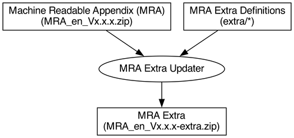

# ECHONET MRA Extra Updater

[Machine Readable Appendix (MRA)][mra] is a data file that describes the contents of [APPENDIX Detailed Requirements for ECHONET Device objects][app]. The detailed requirements define more than 100 device objects, but [MRA][mra] does not all coverd the defined device objects yet.

This [MRA][mra] extra updater is intended to complement [MRA][mra] distributed by [ECHONET Consortium][eneto], adding extra device objects that are not defined in [MRA][mra]. The [MRA][mra] extra updater merges extra definitions with the standard [MRA][mra], and outputs the merged archive [MRA][mra] file as the following:



## Additional Devices

The [MRA][mra] extra updater adds the following extra devices and definitions.

- devices
  - Air pressure sensor (0x002D)
- definitions
  - number_0-65533hPa

## Usage

To create the merged archive [MRA][mra] file, run `make` command as the following:

```
make
```

The repository updater expects the following commands to be installed in your environment.

- make
- wget
- zip
- unzip
- jq

## References

- [APPENDIX Detailed Requirements for ECHONET Device Objects | ECHONET Specifications]()

[mra]:https://echonet.jp/spec_mra_rp1_en/
[eneto]:https://echonet.jp/organization_en/
[app]:https://echonet.jp/spec-en/
